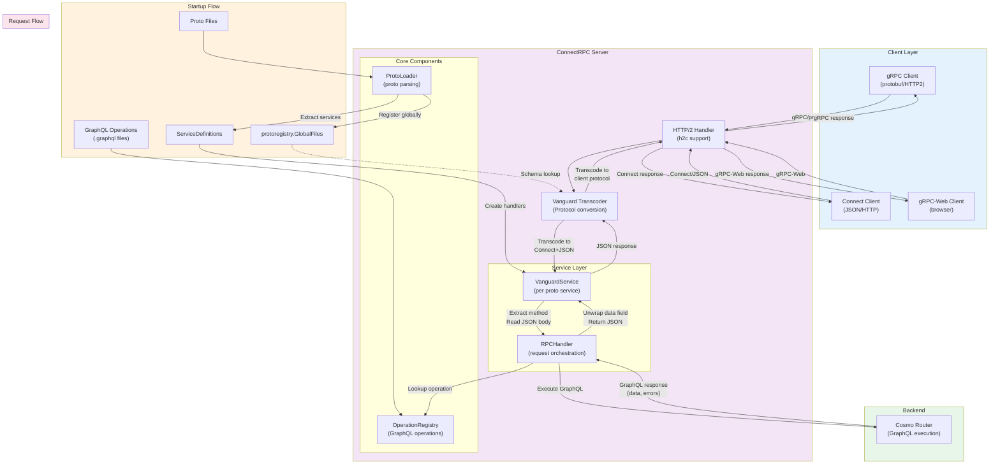

# ConnectRPC Integration for Cosmo Router

This package provides ConnectRPC integration for the Cosmo Router, enabling gRPC, Connect, and gRPC-Web protocol support with automatic GraphQL translation.

## Table of Contents

- [Overview](#overview)
- [Features](#features)
- [Architecture](#architecture)
- [Getting Started](#getting-started)
- [Naming Conventions](#naming-conventions)
- [Usage Examples](#usage-examples)
- [Protocol Support](#protocol-support)
- [Configuration](#configuration)
- [Testing](#testing)

## Overview

The ConnectRPC integration allows you to expose your GraphQL API through gRPC-compatible protocols. It uses [Vanguard](https://github.com/connectrpc/vanguard) for protocol transcoding and requires pre-defined GraphQL operations mapped to RPC methods.

## Features

- ✅ **Multi-Protocol Support**: gRPC, Connect, and gRPC-Web
- ✅ **Automatic Translation**: Proto messages ↔ GraphQL operations
- ✅ **Header Forwarding**: Transparent header propagation to GraphQL endpoint
- ✅ **Hot Reload**: Update proto files and operations without restart
- ✅ **Type Safety**: Full protobuf type checking
- ✅ **Naming Convention**: Query/Mutation prefixes for operation type detection

## Architecture

The ConnectRPC server provides a bridge between gRPC/Connect/gRPC-Web protocols and GraphQL, with automatic protocol transcoding via Vanguard.



### Key Components

1. **ProtoLoader**
   - Parses `.proto` files at startup
   - Registers file descriptors in `protoregistry.GlobalFiles` (required for Vanguard)
   - Extracts service and method definitions

2. **Vanguard Transcoder**
   - Handles protocol conversion between gRPC, Connect, and gRPC-Web
   - Configured to transcode all incoming requests to Connect protocol with JSON codec
   - Transcodes responses back to the client's protocol

3. **VanguardService**
   - One instance per proto service
   - Extracts method name from request path
   - Validates method exists
   - Delegates to RPCHandler

4. **RPCHandler**
   - Looks up GraphQL operation from OperationRegistry
   - Executes GraphQL query against Cosmo Router
   - **Unwraps GraphQL response**: Extracts `data` field from `{"data": {...}, "errors": [...]}` wrapper
   - Returns JSON payload matching proto response message structure

5. **OperationRegistry**
   - Loaded from `.graphql` files at startup
   - Provides O(1) operation lookup at runtime
   - Maps RPC method names to GraphQL operations

### Protocol Flow

1. **Incoming Request**:
   - Client sends request in any protocol (gRPC/Connect/gRPC-Web)
   - Vanguard transcodes to Connect protocol with JSON codec
   - Handler receives consistent JSON format

2. **GraphQL Execution**:
   - Handler looks up predefined GraphQL operation from registry
   - Forwards request to Cosmo Router with headers
   - Receives GraphQL response: `{"data": {...}, "errors": [...]}`

3. **Response Processing**:
   - Handler unwraps `data` field from GraphQL response
   - Returns JSON matching proto response message structure
   - Vanguard transcodes JSON back to client's protocol

4. **Outgoing Response**:
   - Client receives response in their original protocol
   - gRPC clients get protobuf over HTTP/2
   - Connect clients get JSON over HTTP
   - gRPC-Web clients get browser-compatible format

### Critical Implementation Details

- **HTTP/2 Support**: Uses `h2c` (HTTP/2 Cleartext) for gRPC compatibility
- **Response Writer**: Implements `http.Flusher`, `http.Pusher`, and `http.Hijacker` interfaces for streaming
- **Global Registry**: Proto descriptors must be registered globally for Vanguard schema lookup
- **GraphQL Unwrapping**: Response data field must be extracted to match proto message structure

## Getting Started

### 1. Define Your Proto Service

Create a `.proto` file following the naming convention:

```protobuf
syntax = "proto3";

package myapp.v1;

service UserService {
  // Query operations (read-only)
  // IMPORTANT: Each RPC must have its own Request and Response messages
  rpc QueryGetUser(QueryGetUserRequest) returns (QueryGetUserResponse) {}
  rpc QueryListUsers(QueryListUsersRequest) returns (QueryListUsersResponse) {}
  
  // Mutation operations (write)
  rpc MutationCreateUser(MutationCreateUserRequest) returns (MutationCreateUserResponse) {}
  rpc MutationUpdateUser(MutationUpdateUserRequest) returns (MutationUpdateUserResponse) {}
}

message QueryGetUserRequest {
  int32 id = 1;
}

message QueryGetUserResponse {
  User user = 1;
}

message User {
  int32 id = 1;
  string name = 2;
  string email = 3;
}

// ... other messages
```

### 2. Create GraphQL Operations

Create `.graphql` files for each RPC method in your operations directory:

```graphql
# operations/QueryGetUser.graphql
query QueryGetUser($id: Int!) {
  user(id: $id) {
    id
    name
    email
  }
}
```

### 3. Start the ConnectRPC Server

```go
package main

import (
    "github.com/wundergraph/cosmo/router/pkg/connectrpc"
    "go.uber.org/zap"
)

func main() {
    logger, _ := zap.NewProduction()
    
    server, err := connectrpc.NewServer(connectrpc.ServerConfig{
        ProtoDir:        "./proto",
        OperationsDir:   "./operations",
        GraphQLEndpoint: "http://localhost:4000/graphql",
        ListenAddr:      "0.0.0.0:50051",
        Logger:          logger,
    })
    if err != nil {
        logger.Fatal("failed to create server", zap.Error(err))
    }
    
    if err := server.Start(); err != nil {
        logger.Fatal("failed to start server", zap.Error(err))
    }
    
    // Wait for shutdown signal
    // ...
}
```

### 4. Make Requests

See [Usage Examples](#usage-examples) below for detailed examples.

## Naming Conventions

### Method Naming

RPC methods **must** follow these naming conventions:

- **Query Operations**: Prefix with `Query`
  - `QueryGetUser` → GraphQL Query
  - `QueryListProducts` → GraphQL Query
  - `QuerySearchOrders` → GraphQL Query

- **Mutation Operations**: Prefix with `Mutation`
  - `MutationCreateUser` → GraphQL Mutation
  - `MutationUpdateProduct` → GraphQL Mutation
  - `MutationDeleteOrder` → GraphQL Mutation

### Examples

✅ **Correct:**
```protobuf
service UserService {
  // Each RPC has its own dedicated Request and Response messages
  rpc QueryGetUser(QueryGetUserRequest) returns (QueryGetUserResponse) {}
  rpc MutationCreateUser(MutationCreateUserRequest) returns (MutationCreateUserResponse) {}
}

message QueryGetUserRequest {
  int32 id = 1;
}

message QueryGetUserResponse {
  User user = 1;
}
```

❌ **Incorrect:**
```protobuf
service UserService {
  rpc GetUser(GetUserRequest) returns (User) {}  // Missing Query prefix
  rpc CreateUser(CreateUserRequest) returns (User) {}  // Missing Mutation prefix
  rpc QueryGetUser(GetUserRequest) returns (User) {}  // Shared message types - should be QueryGetUserRequest/Response
}
```

## Usage Examples

### Using gRPC Protocol

#### 1. Using grpcurl

```bash
# List available services
grpcurl -plaintext localhost:50051 list

# Describe a service
grpcurl -plaintext localhost:50051 describe employee.v1.EmployeeService

# Call QueryGetEmployees (no parameters)
grpcurl -plaintext \
  -d '{}' \
  localhost:5026 \
  employee.v1.EmployeeService/QueryGetEmployees

# Call QueryGetEmployeeById with parameters
grpcurl -plaintext \
  -d '{"employee_id": 1}' \
  localhost:5026 \
  employee.v1.EmployeeService/QueryGetEmployeeById

# Call MutationUpdateEmployeeMood with headers
grpcurl -plaintext \
  -H "Authorization: Bearer YOUR_TOKEN" \
  -d '{"employee_id": 1, "mood": "MOOD_HAPPY"}' \
  localhost:5026 \
  employee.v1.EmployeeService/MutationUpdateEmployeeMood

# Using proto file for reflection
grpcurl -plaintext \
  -import-path router/pkg/connectrpc/testdata/employee_only \
  -proto employee.proto \
  -d '{"employee_id": 1}' \
  localhost:5026 \
  employee.v1.EmployeeService/QueryGetEmployeeById
```

#### 2. Using Go Client

```go
package main

import (
    "context"
    "log"
    
    "google.golang.org/grpc"
    "google.golang.org/grpc/credentials/insecure"
    
    pb "myapp/gen/proto/myapp/v1"
)

func main() {
    conn, err := grpc.NewClient(
        "localhost:50051",
        grpc.WithTransportCredentials(insecure.NewCredentials()),
    )
    if err != nil {
        log.Fatal(err)
    }
    defer conn.Close()
    
    client := pb.NewUserServiceClient(conn)
    
    // Query operation
    user, err := client.QueryGetUser(context.Background(), &pb.GetUserRequest{
        Id: 1,
    })
    if err != nil {
        log.Fatal(err)
    }
    log.Printf("User: %+v", user)
    
    // Mutation operation
    newUser, err := client.MutationCreateUser(context.Background(), &pb.CreateUserRequest{
        Name:  "Jane Doe",
        Email: "jane@example.com",
    })
    if err != nil {
        log.Fatal(err)
    }
    log.Printf("Created user: %+v", newUser)
}
```

### Using Connect Protocol

The Connect protocol supports both POST and GET requests. Methods marked with `option idempotency_level = NO_SIDE_EFFECTS;` in the proto file can use GET requests.

#### 1. Using curl with Connect Protocol (POST)

```bash
# Query operation (POST)
curl -X POST http://localhost:50051/myapp.v1.UserService/QueryGetUser \
  -H "Content-Type: application/json" \
  -d '{"id": 1}'

# Mutation operation with authentication (POST only)
curl -X POST http://localhost:50051/myapp.v1.UserService/MutationCreateUser \
  -H "Content-Type: application/json" \
  -H "Authorization: Bearer YOUR_TOKEN" \
  -d '{
    "name": "John Doe",
    "email": "john@example.com"
  }'

# List users with pagination (POST)
curl -X POST http://localhost:50051/myapp.v1.UserService/QueryListUsers \
  -H "Content-Type: application/json" \
  -d '{
    "page": 1,
    "pageSize": 10,
    "filter": "active"
  }'
```

#### 2. Using curl with Connect Protocol (GET)

For Query operations marked with `NO_SIDE_EFFECTS`, you can use GET requests. The Connect protocol requires specific query parameters:

```bash
# Simple query with no parameters (GET)
# Required query params: encoding=json, connect=v1
curl --get \
  --data-urlencode 'encoding=json' \
  --data-urlencode 'message={}' \
  --data-urlencode 'connect=v1' \
  http://localhost:5026/employee.v1.EmployeeService/QueryGetEmployees

# Query with parameters using --data-urlencode (recommended)
curl --get \
  --data-urlencode 'encoding=json' \
  --data-urlencode 'message={"employee_id":1}' \
  --data-urlencode 'connect=v1' \
  http://localhost:5026/employee.v1.EmployeeService/QueryGetEmployeeById

# Query with boolean parameter
curl --get \
  --data-urlencode 'encoding=json' \
  --data-urlencode 'message={"has_pets":true}' \
  --data-urlencode 'connect=v1' \
  http://localhost:5026/employee.v1.EmployeeService/QueryFindEmployeesByPets

# With authentication header
curl --get \
  --data-urlencode 'encoding=json' \
  --data-urlencode 'message={}' \
  --data-urlencode 'connect=v1' \
  -H "Authorization: Bearer YOUR_TOKEN" \
  http://localhost:5026/employee.v1.EmployeeService/QueryGetEmployees

# Manual URL encoding (if needed)
curl "http://localhost:5026/employee.v1.EmployeeService/QueryGetEmployeeById?encoding=json&message=%7B%22employee_id%22%3A1%7D&connect=v1"

# For binary proto encoding (base64)
curl --get \
  --data-urlencode 'encoding=proto' \
  --data-urlencode 'base64=1' \
  --data-urlencode 'message=CAE=' \
  --data-urlencode 'connect=v1' \
  http://localhost:5026/employee.v1.EmployeeService/QueryGetEmployeeById
```

**Connect Protocol GET Request Requirements:**
- **Required query parameters:**
  - `encoding`: Message codec (`json` or `proto`)
  - `message`: URL-encoded request payload
  - `connect`: Protocol version (use `v1`)
- **Optional query parameters:**
  - `base64`: Set to `1` for base64-encoded binary data (required when `encoding=proto`)
  - `compression`: Content coding (e.g., `gzip`)
- **Only works for methods with** `option idempotency_level = NO_SIDE_EFFECTS;`
- **Mutations cannot use GET** (they must use POST)
- **Cacheable** by HTTP intermediaries, browsers, and CDNs
- **Use `--data-urlencode`** in curl to automatically handle URL encoding

#### 2. Using TypeScript/JavaScript Client

```typescript
import { createPromiseClient } from "@connectrpc/connect";
import { createConnectTransport } from "@connectrpc/connect-web";
import { UserService } from "./gen/myapp/v1/user_service_connect";

const transport = createConnectTransport({
  baseUrl: "http://localhost:50051",
});

const client = createPromiseClient(UserService, transport);

// Query operation
const user = await client.queryGetUser({ id: 1 });
console.log("User:", user);

// Mutation operation
const newUser = await client.mutationCreateUser({
  name: "Jane Doe",
  email: "jane@example.com",
});
console.log("Created user:", newUser);

// With custom headers
const userWithAuth = await client.queryGetUser(
  { id: 1 },
  {
    headers: {
      Authorization: "Bearer YOUR_TOKEN",
    },
  }
);
```

### Using gRPC-Web Protocol

#### 1. Using curl with gRPC-Web

```bash
# Query operation (base64 encoded protobuf)
curl -X POST http://localhost:50051/myapp.v1.UserService/QueryGetUser \
  -H "Content-Type: application/grpc-web+proto" \
  -H "X-Grpc-Web: 1" \
  --data-binary @request.bin

# For JSON format
curl -X POST http://localhost:50051/myapp.v1.UserService/QueryGetUser \
  -H "Content-Type: application/grpc-web-text+json" \
  -H "X-Grpc-Web: 1" \
  -d '{"id": 1}'
```

#### 2. Using grpcwebproxy

```bash
# Start grpcwebproxy
grpcwebproxy \
  --backend_addr=localhost:50051 \
  --run_tls_server=false \
  --allow_all_origins

# Make request through proxy
curl -X POST http://localhost:8080/myapp.v1.UserService/QueryGetUser \
  -H "Content-Type: application/json" \
  -d '{"id": 1}'
```

### Advanced Examples

#### Batch Operations

```bash
# Batch create users
curl -X POST http://localhost:50051/myapp.v1.UserService/MutationBatchCreateUsers \
  -H "Content-Type: application/json" \
  -d '{
    "users": [
      {"name": "User 1", "email": "user1@example.com"},
      {"name": "User 2", "email": "user2@example.com"},
      {"name": "User 3", "email": "user3@example.com"}
    ]
  }'
```

#### Complex Queries with Filtering

```bash
# Search products with filters
curl -X POST http://localhost:50051/myapp.v1.ProductService/QuerySearchProducts \
  -H "Content-Type: application/json" \
  -d '{
    "query": "laptop",
    "categories": ["electronics", "computers"],
    "priceRange": {
      "minPrice": 500,
      "maxPrice": 2000
    },
    "limit": 20
  }'
```

#### Error Handling

```bash
# Request with invalid data
curl -X POST http://localhost:50051/myapp.v1.UserService/QueryGetUser \
  -H "Content-Type: application/json" \
  -d '{"id": -1}' \
  -v

# Response will include error details:
# {
#   "code": "invalid_argument",
#   "message": "Invalid user ID",
#   "details": [...]
# }
```

## Protocol Support

### gRPC

- **Port**: Default 50051
- **Content-Type**: `application/grpc`
- **Features**: Full gRPC support including streaming (future)

### Connect

- **Port**: Same as gRPC (50051)
- **Content-Type**: `application/json` or `application/proto`
- **Features**: HTTP/1.1 and HTTP/2, JSON and binary formats

### gRPC-Web

- **Port**: Same as gRPC (50051)
- **Content-Type**: `application/grpc-web+proto` or `application/grpc-web-text`
- **Features**: Browser-compatible, works with standard HTTP

## Configuration

### ServerConfig Options

```go
type ServerConfig struct {
    // ProtoDir is the directory containing proto files (required)
    ProtoDir string
    
    // OperationsDir is the directory containing pre-defined GraphQL operations (required)
    OperationsDir string
    
    // ListenAddr is the address to listen on (default: "localhost:5026")
    ListenAddr string
    
    // GraphQLEndpoint is the router's GraphQL endpoint (required)
    GraphQLEndpoint string
    
    // Logger for structured logging (default: nop logger)
    Logger *zap.Logger
    
    // RequestTimeout for HTTP requests (default: 30s)
    RequestTimeout time.Duration
}
```

### Operation Files

Each RPC method requires a corresponding `.graphql` file in the operations directory. The file should be named after the RPC method (e.g., `QueryGetUser.graphql` for the `QueryGetUser` RPC method).

**Example:**
```graphql
# operations/QueryGetUser.graphql
query QueryGetUser($id: Int!) {
  user(id: $id) {
    id
    name
    email
  }
}
```

**Benefits:**
- Full control over GraphQL queries
- Optimized queries for specific use cases
- Better for complex operations
- Explicit and reviewable operations
- Follows industry standards (Trusted Documents pattern)

## Testing

### Unit Tests

Run unit tests for the ConnectRPC package:

```bash
cd router/pkg/connectrpc
go test -v ./...
```

### Integration Tests

Run integration tests:

```bash
cd router-tests
go test -v -run TestConnectRPC
```

### Manual Testing

1. Start the router:
```bash
cd router
go run ./cmd/router/main.go
```

2. Start the ConnectRPC server:
```bash
go run ./examples/connectrpc/main.go
```

3. Test with grpcurl:
```bash
grpcurl -plaintext localhost:50051 list
```

## Troubleshooting

### Common Issues

#### 1. "service not found" Error

**Problem**: Service is not discovered from proto files.

**Solution**: 
- Verify proto files are in the correct directory
- Check proto syntax is valid
- Ensure service names follow conventions

#### 2. "method not found" Error

**Problem**: RPC method doesn't follow naming convention.

**Solution**:
- Ensure methods are prefixed with `Query` or `Mutation`
- Check method name spelling

#### 3. GraphQL Errors

**Problem**: GraphQL endpoint returns errors.

**Solution**:
- Verify GraphQL endpoint is accessible
- Check GraphQL schema matches proto definitions
- Review header forwarding configuration

#### 4. Connection Refused

**Problem**: Cannot connect to ConnectRPC server.

**Solution**:
- Verify server is running
- Check listen address and port
- Ensure firewall allows connections

### Debug Logging

Enable debug logging:

```go
logger, _ := zap.NewDevelopment()
server, err := connectrpc.NewServer(connectrpc.ServerConfig{
    // ... other config
    Logger: logger,
})
```

## Best Practices

1. **Use Descriptive Method Names**: `QueryGetUserById` is better than `QueryGet`
2. **Follow Naming Conventions**: Always prefix with `Query` or `Mutation`
3. **Version Your APIs**: Use package versioning (e.g., `myapp.v1`, `myapp.v2`)
4. **Document Your Proto Files**: Add comments to services and methods
5. **Handle Errors Gracefully**: Return meaningful error messages
6. **Use Pagination**: For list operations, always support pagination
7. **Validate Input**: Validate request data before processing
8. **Monitor Performance**: Track request latency and error rates

## Examples

See the `testdata/examples/` directory for complete examples:

- [`user_service.proto`](testdata/examples/user_service.proto) - Basic CRUD operations
- [`product_service.proto`](testdata/examples/product_service.proto) - Advanced patterns

## Contributing

Contributions are welcome! Please see the main Cosmo repository for contribution guidelines.

## License

See the main Cosmo repository for license information.